# Fleet Manager


## Table of Contents

- [Application Overview](#application-overview)
- [Technologies](#technologies)
- [Architecture](#architecture)
- [Project Structure](#project-structure)
- [Installation](#installation)
- [Usage](#usage)
- [Roadmap](#roadmap)
- [Project Preview](#project-preview)
- [Tests](#tests)
- [Development Workflow](#development-workflow)
- [Contribution](#contribution)
- [Author](#author)

---

## Application Overview

Fleet Manager is an Angular 20 application designed to help users manage their personal vehicle garage. It allows each user to organize their vehicles, track their locations, schedule vehicle usage through an interactive calendar, and visualize detailed usage statistics.

The application follows a modular architecture based on reusable components and integrates user authentication, route guards, API communication, state management, reactive forms with validation, and data persistence.

### Main Features

- **User Authentication:** Register and sign in using an email address and password. Each user has an independent account with their own personal data.
- **Vehicle Management (CRUD):** Create, view, update, and delete vehicles within your personal garage. The vehicle table includes search and sorting capabilities to quickly find and organize vehicles. Vehicle owners have full control over their vehicles and their configuration.
- **Vehicle Sharing and Permissions:** Share vehicles with other users and manage access levels. Users with granted access can view vehicle information, update locations, create and manage usage events, and access statistics, while owner-only actions such as editing or deleting the vehicle remain restricted to the owner.
- **Interactive Map:** View all registered vehicles on an interactive map. Vehicle locations can be updated by dragging and dropping markers or by using the geolocation feature to automatically set a vehicle's location based on the user's current position. The map also supports filtering vehicles to display a specific vehicle.
- **Vehicle Usage Calendar:** Schedule vehicle usage events with specific start and end dates and times.
- **Event Management (CRUD):** Create, view, update, and delete usage events directly from the calendar.
- **Usage Validation:** Prevent overlapping usage events for the same vehicle and validate that event time ranges are logically consistent, avoiding invalid schedules where the end time occurs before the start time.
- **Dynamic Filtering:** Filter usage events by vehicle or display events from the entire garage.
- **Comments:** Add comments to scheduled events.
- **Statistics Dashboard:**
  - Total accumulated usage hours per vehicle.
  - Most-used vehicle.
  - Distribution of usage hours by day of the week.

Fleet Manager combines vehicle management, interactive mapping, scheduling, and statistical analysis into a single integrated platform.

---

## Technologies

### Frontend
- `Angular 20`
- `TypeScript`
- `SCSS`
- `HTML5`

### UI and Visualization Libraries
- `PrimeNG`
- `Leaflet`
- `FullCalendar`
- `Chart.js`

### Backend
- `NestJS`
- `MongoDB`

### Authentication
- `Firebase Authentication`

### Testing
- `Jasmine & Karma`

---

## Architecture

Fleet Manager follows a **feature-based architecture**, where the application is organized by business domains instead of grouping files only by their technical role. This approach keeps related functionality together, making the codebase easier to understand, maintain, and extend.

The application is divided into three main areas:

### Core

The `core` folder contains application-wide infrastructure that is shared across the entire application. These elements are created once and are not tied to a specific business feature.

Examples include:

- Global layout components such as the header, navigation and account drawer.
- Route guards.
- Cross-cutting services such as authorization, geolocation and theme management.

### Features

The `features` folder contains the application's business domains. Each feature is self-contained and groups together everything required for that area of functionality.

Depending on its needs, a feature owns its:

- Pages.
- Components.
- Data-access services.
- State management.
- Routes.
- Domain models, interfaces, enums and other feature-specific resources.

For example:

- `auth` manages authentication and registration.
- `vehicle` contains vehicle management functionality.
- `map` provides the interactive map experience.
- `calendar` manages vehicle usage scheduling.
- `graphics` contains the statistics dashboard.

Keeping these resources together allows each feature to evolve independently while reducing coupling between different parts of the application.

### Shared

The `shared` folder contains reusable building blocks that are not specific to any single feature.

This includes:

- Reusable UI components.
- Generic modal components.
- Pipes.
- Directives.
- Shared models and utilities when required.

Resources placed in `shared` are intended to be reused across multiple features without containing business-specific logic.

---

## Project Structure

```bash
src/
├─ app/
│  ├─ core/                         # Global application infrastructure
│  │  ├─ guards/
│  │  ├─ layout/                    # Header, navigation, global UI components
│  │  └─ services/                  # Global services (auth, geolocation, theme)
│  │
│  ├─ features/                     # Main application features
│  │  ├─ auth/                      # Login, registration, interceptors
│  │  ├─ vehicle/                   # Vehicle management (CRUD, state, modals)
│  │  ├─ map/                       # Interactive map (Leaflet)
│  │  ├─ calendar/                  # Events and scheduling (FullCalendar)
│  │  └─ graphics/                  # Statistics and data visualization (Chart.js)
│  │
│  ├─ shared/                       # Reusable components
│  │  ├─ ui/                        # Buttons, modals, generic UI components
│  │  ├─ pipes/
│  │  ├─ directives/
│  │  └─ models/
│  │
│  ├─ app.config.ts
│  ├─ app.routes.ts
│  ├─ main.ts
│  └─ app.html / app.scss / app.ts
│
├─ assets/
│  ├─ icons/
│  └─ readme/
│
├─ environments/
├─ styles/                          # Global SCSS styling system
│  ├─ abstracts/                    # Variables and mixins
│  ├─ base/                         # Reset and base typography
│  ├─ themes/                       # Light / dark themes
│  ├─ tokens/                       # Design system (spacing, colors, radius, etc.)
│  └─ utilities/                    # SCSS helpers
│
└─ index.html
```

---

## Installation

The application is divided into two repositories:
- Frontend → Angular 20 https://github.com/JordiMiravet/FleetManager-Frontend.git
- Backend → NestJS https://github.com/JordiMiravet/FleetManager-Backend.git

Both repositories need to be running for the application to work correctly.

#### Prerequisites

- Node.js v20 or higher
- Angular CLI (`npm install -g @angular/cli`)
- MongoDB running

#### 1. Frontend

Clone the repository:

```bash
    git clone https://github.com/JordiMiravet/FleetManager-Frontend.git
    cd fleetmanager-frontend
    npm install
```
Firebase Authentication configuration:

- Configure Firebase Authentication:
    - Create a project in Firebase Console
    - Enable Email/Password Authentication
    - Add a web application and copy the configuration
    - Create src/environments/environment.ts with your configuration

Inside src, create the environments folder and add the file:

```bash
    src/environments/environment.ts
```

With the following content, replacing the values with your project configuration:

```typescript
    export const environment = {
        production: true,
        firebaseConfig: {
            apiKey: "YOUR_API_KEY",
            authDomain: "YOUR_AUTH_DOMAIN",
            projectId: "YOUR_PROJECT_ID",
            storageBucket: "YOUR_STORAGE_BUCKET",
            messagingSenderId: "YOUR_MESSAGING_SENDER_ID",
            appId: "YOUR_APP_ID"
        }
    };
```

#### 2. Backend

Clone the backend repository:

```bash
    git clone https://github.com/JordiMiravet/FleetManager-Backend.git
    cd fleetmanager-backend
    npm install
```

Create a .env file in the project root with the following content:

```env
    PORT=3000
    MONGO_URI=mongodb://localhost:27017/whereismycar

    FIREBASE_PROJECT_ID=your_project_id
    FIREBASE_CLIENT_EMAIL=your_client_email
    FIREBASE_PRIVATE_KEY=your_private_key
```

Firebase credentials can be obtained from:

Firebase Console → Project Settings → Service Accounts → Generate new private key.

From the downloaded JSON file, you need:

- project_id
- client_email
- private_key

The private_key must remain on a single line and preserve the \n characters.

#### 3. Run the application

First, start the backend:

```code
    npm run start:dev
```

Then, in another terminal inside the frontend project, start the frontend:

```bash
    ng serve
```

Open the application in your browser:

```bash
    http://localhost:4200
```


Notes
- Node.js must be installed.
- Angular CLI must be installed globally:
```bash
    npm install -g @angular/cli
```
- Real credentials are not included in the repository.
- Each developer must use their own Firebase project.

---

## Usage

1. Open the application in your browser: http://localhost:4200
2. Register a new user account using an email address and password.
3. Sign in with your credentials.
4. Manage your vehicles from the vehicle management panel:
   - Create, edit, and delete vehicles.
   - Search and sort vehicles using the table controls.
   - Share vehicles with other users and manage access permissions.
5. View and manage vehicles on the interactive map (Map):
   - All registered vehicles are displayed by default.
   - Filter vehicles to display a specific vehicle on the map.
   - Update vehicle locations by dragging and dropping map markers.
   - Update a vehicle location automatically using the geolocation feature to set it to the user's current position.
6. Schedule and manage vehicle usage events through the calendar (Calendar):
   - Create, edit, and delete usage events for each vehicle.
   - Define specific start and end dates and times for each event.
   - The application prevents overlapping usage events for the same vehicle.
   - The application validates that event time ranges are consistent, preventing invalid schedules where the end time occurs before the start time.
   - Events can be filtered by vehicle or displayed for the entire garage.
   - Add comments to scheduled events.
7. View vehicle statistics in the dashboard (Graphics):
   - Analyze total accumulated usage hours per vehicle.
   - Identify the most-used vehicle.
   - View usage hour distribution by day of the week.
   - Filter statistics by period: This Month, This Year, and All Time.

---

## Roadmap

This project is continuously evolving to improve its scalability, maintainability, and production readiness. The following roadmap outlines planned features and architectural improvements that will be introduced progressively.

### 1. Notification & Invitation System (In Progress)
- Replace the current direct vehicle sharing workflow with an invitation-based system.
- Add notification management with pending invitations and accept/reject actions.
- Introduce reusable notification infrastructure for future application events.

### 2. Internationalization (i18n)
- Add multi-language support starting with English and Spanish.
- Move static application messages into translation resources.
- Prepare the application architecture for future language extensions.

### 3. Design System and Theme Improvements
- Improve the existing SCSS architecture with a more complete design system.
- Expand design tokens for colors, spacing, typography, and component consistency.
- Implement persistent light/dark mode preferences.

### 4. State Management Improvements
- Review current state handling patterns across features.
- Introduce clearer state ownership and separation of responsibilities.
- Improve scalability as new application features are added.

### 5. Backend and Data Architecture Improvements
- Review current data models and persistence strategy.
- Evaluate migration from MongoDB to a relational database depending on future requirements.
- Improve API contracts, validation and domain separation.

### 6. Testing Improvements
- Increase test coverage for feature workflows and complex user interactions.
- Add more integration-focused tests where multiple application layers interact.
- Continue improving test maintainability and readability.

### 7. Deployment and CI/CD
- Deploy the application to a production environment.
- Introduce automated checks for testing, linting, and build validation.
- Configure a continuous integration workflow for future contributions.

---

## Project Preview

The following section shows a preview of the application in operation:

#### User Registration
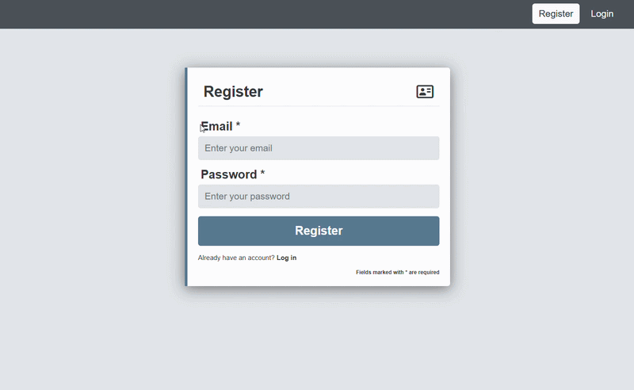

#### User Login
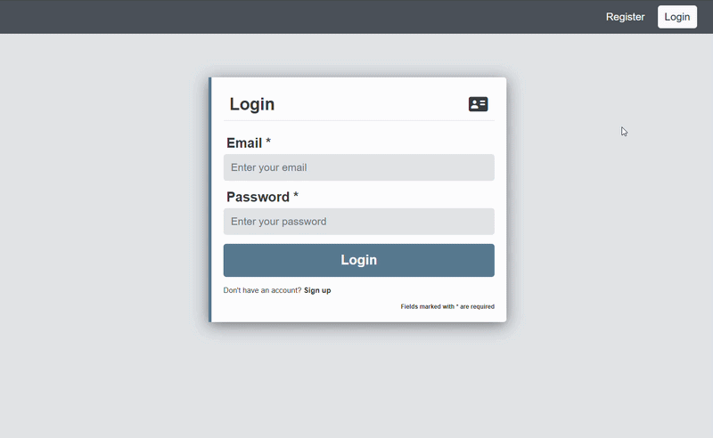

#### Vehicle Management (CRUD)
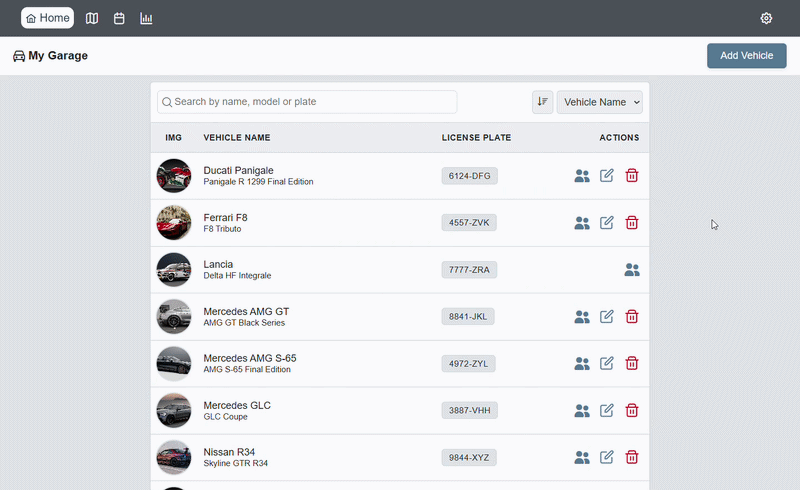
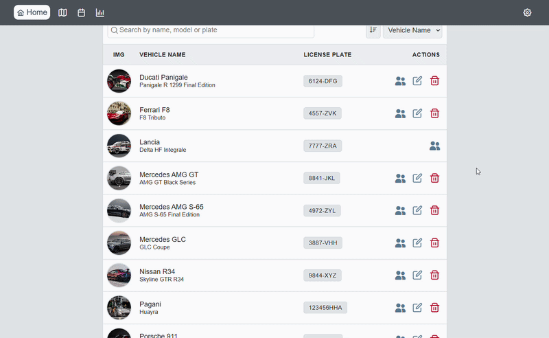
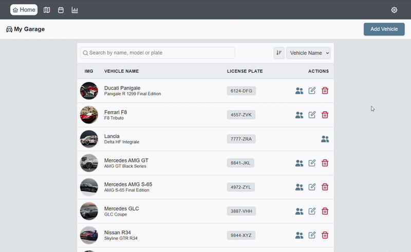

#### Vehicle Management (Vehicle Filtering)
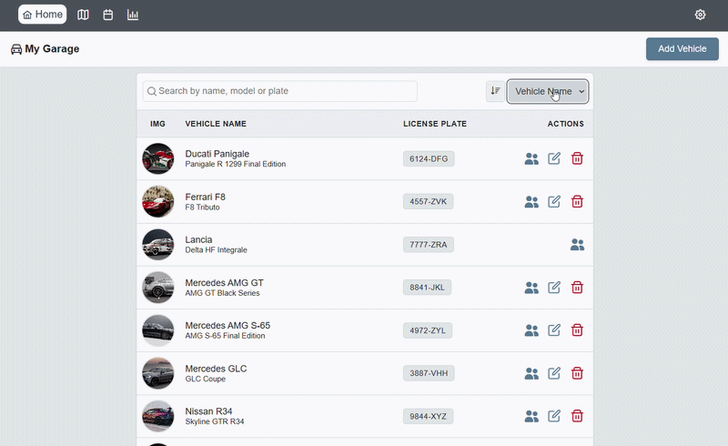

#### Interactive Map (drag & drop and vehicle filtering)
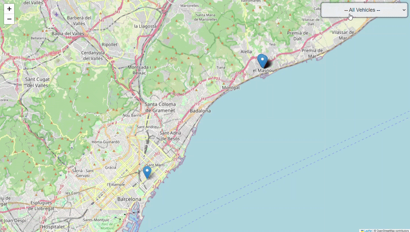


#### Vehicle Usage Calendar (CRUD)
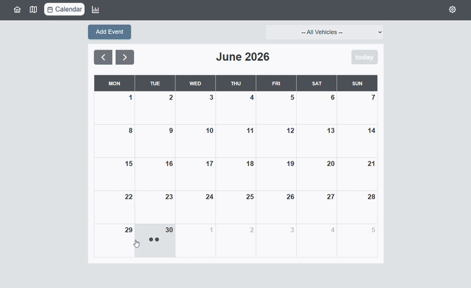
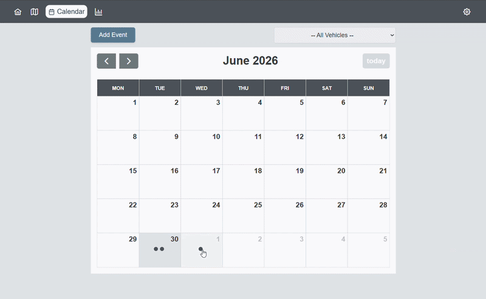

#### Vehicle Usage Calendar (Event Filtering)
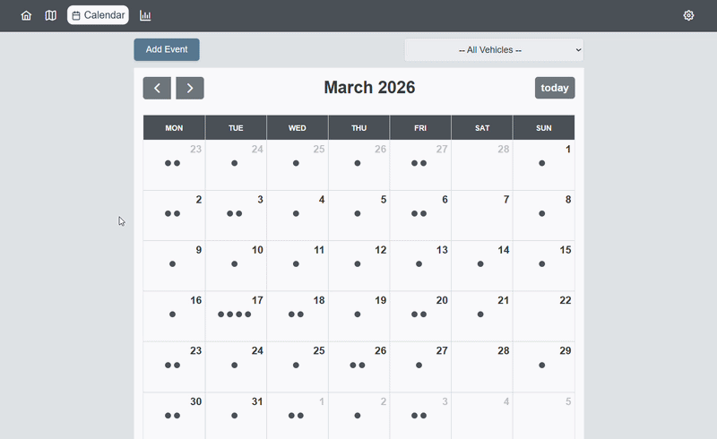

#### Vehicle Usage Calendar (Validation: overlap and time consistency)
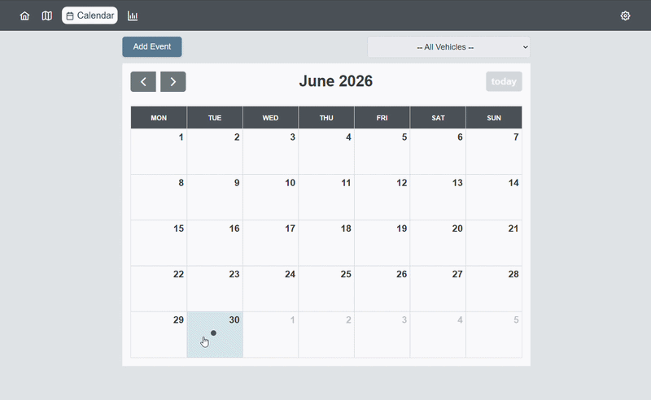
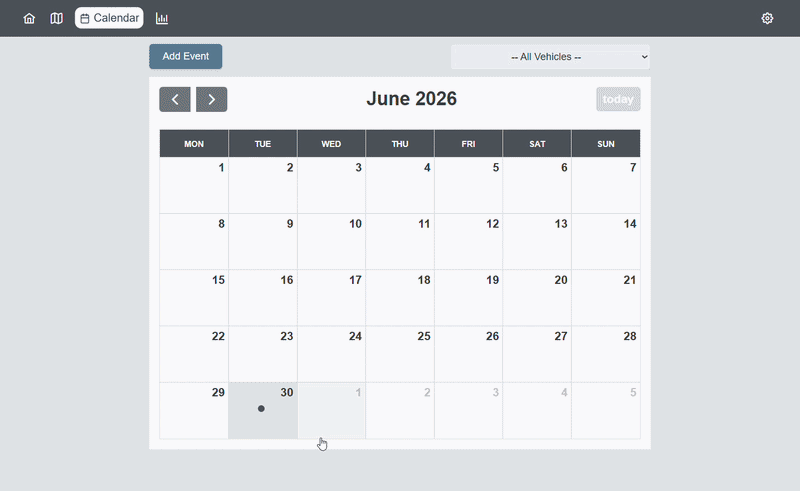

#### Statistics Dashboard
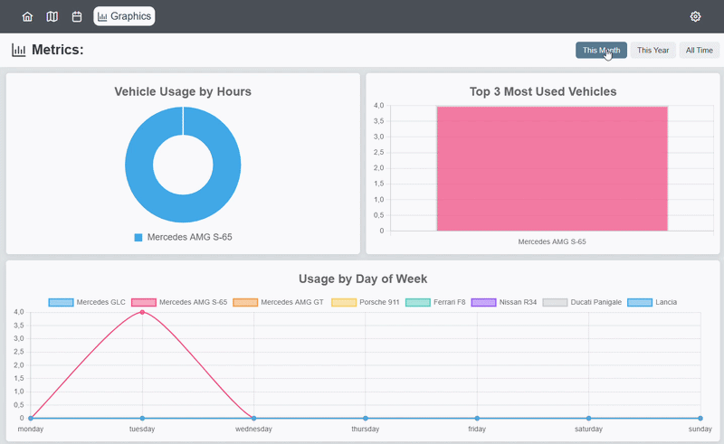

---

## Tests

The application includes unit tests developed with Jasmine, which can be executed using Angular CLI:

```bash
    ng test
```
- Main tested components and services:
  - Components: `VehicleTableComponent`, `CalendarViewComponent`, `MapViewComponent`, `GraphicsViewComponent`
  - Services: `VehicleService`, `CalendarService`, `MapService`, `GraphicsService`
- Coverage:

```markdown
=============================== Coverage summary ===============================
Statements   : 96.6% ( 853/883 )
Branches     : 89.14% ( 156/175 )
Functions    : 95.51% ( 234/245 )
Lines        : 97.11% ( 775/798 )
================================================================================

TOTAL: 691 SUCCESS
```

#### Highlighted example and line-by-line explanation

The following test is one of the most interesting examples, as it combines asynchronous operations, error handling, and fallback logic inside the `saveVehicle` method of the `MapComponent`:

```typescript
it('should use fallback location when geolocation fails', async () => {

    // 1. Mock vehicle to be saved
    const vehicle = {
        name: 'Mercedes GLC Coupe',
        model: 'GLC Coupe',
        plate: '3447VHZ',
    };

    // 2. Set modal mode to 'create'
    vehicleModalStateServiceMock.mode.set('create');

    // 3. Simulate geolocation failure
    geolocationServiceMock.getCurrentLocation.and.rejectWith(new Error('geolocation failed'));

    // 4. Reset addVehicles spies
    vehicleServiceMock.addVehicles.calls.reset();

    // 5. Call saveVehicle
    await component.saveVehicle(vehicle as any);

    // 6. Verify that geolocation was requested
    expect(geolocationServiceMock.getCurrentLocation).toHaveBeenCalled();

    // 7. Verify that the vehicle was added using the fallback location
    expect(vehicleServiceMock.addVehicles).toHaveBeenCalled();
    const addedVehicle = vehicleServiceMock.addVehicles.calls.mostRecent().args[0];
    expect(addedVehicle.location).toEqual({ lat: 41.478, lng: 2.310 });

    // 8. Verify that the modal was closed after completion
    expect(vehicleModalStateServiceMock.close).toHaveBeenCalled();
});
```

#### Template test example

This test ensures that the map is rendered correctly when the vehicle list is not empty:

```Typescript
it('should render map view when vehicle list is not empty', () => {
    vehicleServiceMock.vehicles.set([{
        name: 'Mercedes GLC Coupe',
        model: 'GLC Coupe',
        plate: '3447VHZ',
        location: { lat: 41.486, lng: 2.311 }
    }]);
    fixture.detectChanges();

    const mapView = fixture.nativeElement.querySelector('app-map-view');
    expect(mapView).toBeTruthy();
});
```

Empty state scenarios and modal opening/closing interactions are also tested to ensure correct user interface behavior.

---

## Development Workflow

This project follows a simple Git workflow to keep contributions consistent and easy to review.

### Branch naming

Create a new branch from the main branch using the following convention:

```text
    <type>/<task-number>-<short-description>
```

Examples:

```text
    feature/234-document-development-workflow
    fix/198-handle-null-response
    docs/234-update-readme
```

### Commit messages

Commits follow the following format:

```text
    <type>(<scope>): <short description in English> (#<task-number>)
```

Examples:

```text
    feat(vehicle): add vehicle filtering (#145)
    fix(calendar): prevent overlapping events (#182)
    docs(readme): document development workflow (#234)
```

Keep commit messages concise, written in English, and focused on a single logical change.

### Pull Request workflow

When your work is ready:

1. Ensure your branch is up to date.
2. Push your branch to the remote repository.
3. Open a Pull Request targeting the main branch.
4. Reference the related task in the Pull Request.
5. Address any review feedback before the Pull Request is merged.

### Typical workflow

```bash
    git checkout -b feature/234-document-development-workflow

    # Make your changes

    git add .
    git commit -m "docs(readme): document development workflow (#234)"

    git push origin feature/234-document-development-workflow
```

---

## Contribution

If you want to contribute to this project, you can:

1. Fork the repositories:
   - Frontend: https://github.com/JordiMiravet/FleetManager-Frontend.git
   - Backend: https://github.com/JordiMiravet/FleetManager-Backend.git
2. Create a branch for your new feature or bug fix (`git checkout -b feature/new-feature`).
3. Make clear and descriptive commits.
4. Push your branch.
5. Create a Pull Request describing your changes.

---

## Author

[**Jordi Miravet**](https://www.linkedin.com/in/jordimiravet-dev/)